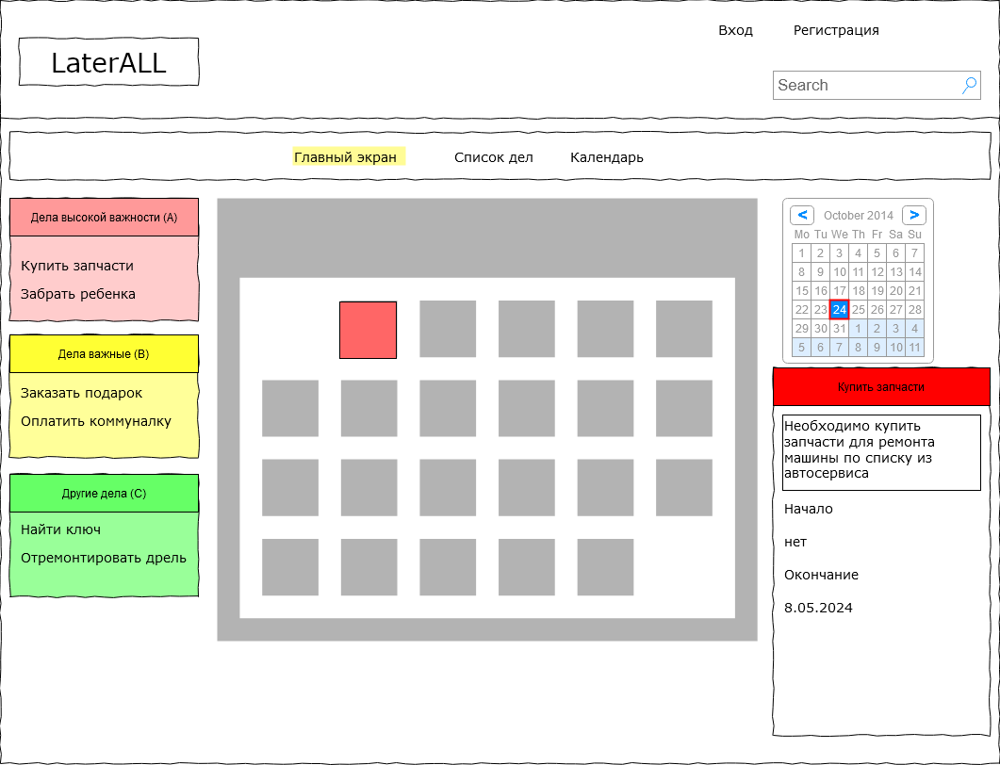
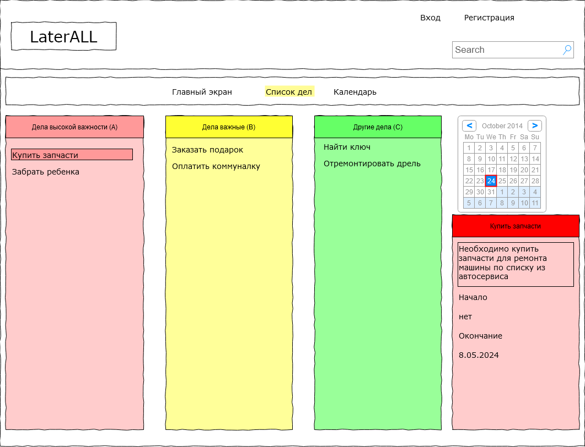

# Название проекта и краткое описание сути
LaterAll – планировщик дел и расписания. Позволяет хранить и заносить дела (таски), а также распределять их по степени важности и срокам исполнения. Имеет визуальное представление в виде как списка дел, так и календаря.
Не такой простой, как чеклист, и не такой заумный, как софт для управления проектами.
# Целевая аудитория и портреты клиентов
## Целевая аудитория по 5W:
- Что? Планирование дел и расписания
- Кто? Молодые люди как мужчины, так и женщины, имеющие жильё, детей и машину
- Почему? Потому что хотят не забывать важные дела, при этом не тратить много времени на организацию их планирования
- Когда? В любое время, фактически ad hoc.
- Где? Информационно: Работа в смартфоне, на компьютере, Физически - где угодно

## Портрет клиента
### Мужчина
- Демографические признаки:
  - Возраст - от 35-45
  - Семейное положение - любое

- Психография:
  - Интересы - воспитание детей, техника, спорт, знания, активная жизненная позиция
  - Проблемы - разностороннесть, ведущая к появлению вороха дел, недостаток времени на сам процесс планирования, начиная с простой записи дел и заканчивая выбором приоритетов и времени выполнения
  - Привычки - стараться много успевать, делать несколько дел одновременно (например, работать и заказывать столик в кафе)

- Социально-экономические данные:
  - Уровень дохода - от среднего и выше
  - Образование - среднее и выше, достаточный уровень компьютерной грамотности
  - Профессия - любая профессия, допускающая адекватное использование смартфона и/или компьютера (программист - подходит, пилот самолёта - подходит пока не летит)

- Поведенческие факторы:
  - Причины покупки/использования - недовольство текущими инструментами планирования типа блокнота или гугл-календаря, желание иметь простой, быстрый, удобный инструмент
  - Сезонность продаж - не играет роли
  - Потребительский набор продуктов - список задач (возможно, с приоритезацией), календарь

# Описание MVP
Программа представляет собой планировщик задач, который позволяет сперва накидывать задачи без конкретной привязки ко времени и приоритету (устанавливаются автоматически), а после разбирать их по приоритетам и назначать временные периоды и сроки выполнения.
Основными экранами является общий экран задач (разделен на 3 части - задачи, календарь и текущая задача) и экран редактирования задачи. Также есть отдельные экраны для показа расширенного списка задач и показа календарного представления.

# Примеры эскизов фронтенда
## Главный экран

## Список задач (расширенное представление)

# Описание сущностей приложения
- Дело – основная сущность в программе (перенести поля из фронтенда)
  - ID – наименование дела
  - Наименование – обязательно для дела.
  - Описание – опциональное поле для пояснений
  - Важность – буква: (С) – низкая (значение по умолчанию, на фронтенде соответствует зелёный цвет), (A) – высокая важность (во фронтенде этому будет соответствовать красный цвет), (B) – средняя важность, желтый цвет соответственно)
  - Приоритет (число от 0 до 100, по умолчанию 0)
  - Начало дела (по умолчанию не установлено)
  - Конец дела – (по умолчанию установлено ровно через неделю)
  - Группа для дела (по умолчанию группа прочее)
  - Видимость (показывать/не показывать другим пользователям в группе пользователей)
  - Дата/время добавления дела (потом используется для сортировки по умолчанию)

- Группа дела – нужна для группировки дел по смыслу их выполнения (например: работа, учеба, домашние дела, машина)
  - ID группы
  - Название группы
  - Примечание (опционально)
    (в первой версии проекта группы задаются константным набором групп)

Для каждой сущности реализованы основные методы CRUDS.

# Архитектура комплекса

